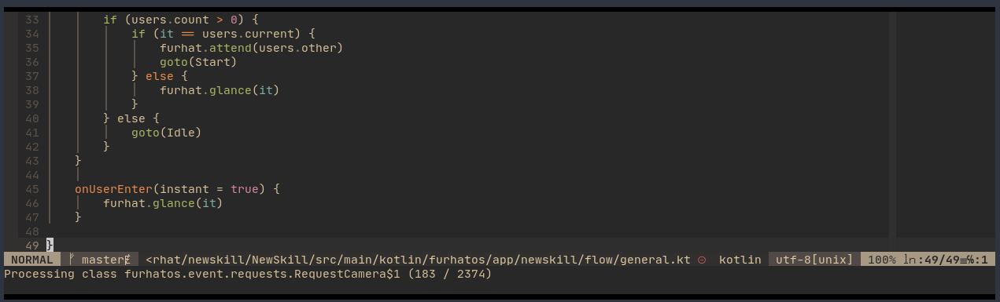
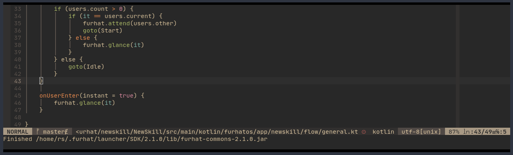
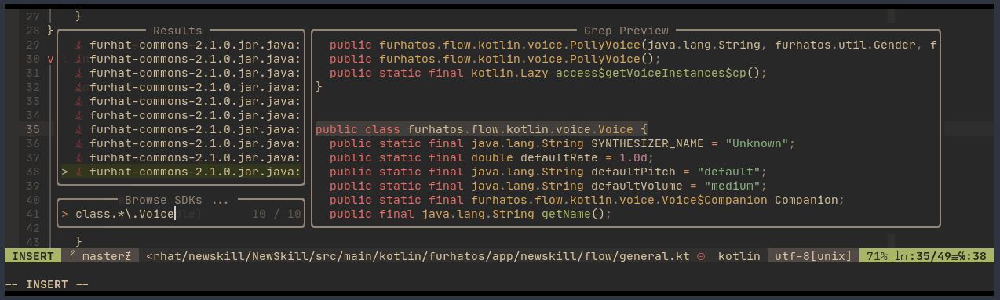

<div align="center">

# JAR SDK Browser for NeoVim

[](http://www.lua.org)
[](https://neovim.io)

</div>

Browse JAR (Java/Kotlin) SDKs from NeoVim via [Telescope.nvim](https://github.com/nvim-telescope/telescope.nvim)!

This plugin serves a very specific purpose: explore and search Java / Jotlin SDKs that you only have in compiled `.jar` form.

## Installation

### Pre-requisites

- install [telescope.nvim](https://github.com/nvim-telescope/telescope.nvim) and its dependencies (plenary.nvim)
- install this plugin with the plugin manager of your choice

Example:

```vim
Plug 'renerocksai/jar-sdk-browser`
```

### Configuration

Add the following lua code to your `init.vim` (or init.lua):

```vim
lua << EOF
    require('jar-sdk-browser').setup({})
EOF
```

At the moment, the only things you can configure, are the paths to your SDK's `jar` and `javap` executables. Normally,
they should reside in your `PATH`, so you shouldn't need to configure them.

If, however, you need to configure those tools' locations, you can do so via:

```vim
lua << EOF
    require('jar-sdk-browser').setup({
        jar_bin = '/run/current-system/sw/bin/jar',
        javap_bin = '/run/current-system/sw/bin/javap',
        })
EOF
```

The above shows an example for NixOS.

## Usage

### Adding an SDK

First, you need to add an SDK to the plugin's SDK repository:

```vim
:Sdkadd /path/to/some/file.jar
```

Above command adds the SDK `file.jar` to the installed SDKs. The installation process involves de-compiling all `.class`
files contained in the `.jar` with the `javap` de-compiler, which is part of the JDK.

Since de-compilation is an involved process, `:Sdkadd` takes a while - depending on the size of the SDK.

`Jar-Sdk-Browser` will keep you up-to-date with its progress in the status line and tell you when it's finished.





If your SDK consists of multiple `.jar` files, you have to repeat the `:Sdkadd` step for each one of them.

While classes are being de-compiled and added to the SDK repository, you can continue using Neovim, and even start
exploring what has been de-compiled so far.

### Searching SDKs

To search your SDKs for the occurence of a specific word, use the following command:

```vim
:Sdks <word>

# for example:
:Sdks Log
```

You can omit the word to start exploring with an empty class search.

The `Sdks` command opens a telescope `live_grep` picker with `class.*\.` plus the optional argument as default text. If
you don't want to search for classes, erase the default text.



When you've found what you were looking for, you can <kbd>ESC</kbd> out of telescope or <kbd>ENTER</kbd> to jump into
the de-compiled `.java` file.

See [Telescope.nvim](https://github.com/nvim-telescope/telescope.nvim) for more information on how to use telescope.

## De-compiled SDK locations

`Jar-Sdk-Browser` will write the de-compiled Java files into its `sdks` sub-directory. The exact location depends on
your plugin manager.

Example:

```console
ls ~/.config/nvim/data/plugged/jar-sdk-browser.nvim/sdks
```
